# 校园反诈平台精细化演示手册（实操版）

> 本手册基于一次真实跑通记录整理，适合答辩、验收和现场演示照着走。
> 实操日期：2026-06-13（北京时间）
> 截图目录：`docs/assets/demo-runbook/`

## 0. 本次实操产生的数据

| 项目 | 值 |
| --- | --- |
| 学生上报标题 | `演示上报-202606121727-冒充客服退款` |
| 案件编号 | `2026-CS-111232` |
| 案件 ID | `191241980230111232` |
| 紧急预警标题 | `演示预警-202606121727-冒充客服退款电话激增` |
| 知识条目标题 | `演示知识-202606121727-冒充客服退款识别` |
| 知识条目 ID | `191242073423351808` |

如果你重新演示，可以沿用同样话术，只把标题里的时间戳和案件编号换成现场生成的值。

### 0.1 预置演示数据速查

执行以下命令后，四个角色登录即可直接操作，无需临时造数据：

```powershell
docker compose exec -T backend python -m app.infra.db.seed
```

学生 `student001` 的预置案件：

| 案件编号 | 初始状态 | 推荐演示操作 |
| --- | --- | --- |
| `2026-CS-900001` | 待审核 | 院系审核员打开详情，演示自动进入审核中 |
| `2026-CS-900003` | 审核中 | 演示“处理完成并录入案例库” |
| `2026-CS-900004` | 审核中 | 演示“驳回并填写对外反馈” |
| `2026-CS-900005` | 审核中、匿名 | 演示匿名保护、转报警和司法协助 |
| `2026-CS-900006` | 已处理 | 学生查看处理结果和时间线 |
| `2026-CS-900007` | 已驳回 | 学生查看补充材料反馈 |
| `2026-CS-900008` | 已转报警 | 展示终态筛选和报警处置结果 |

校级审核员还可看到数学科学学院案件 `2026-MATH-900001`；院系审核员看不到该案，可用于说明院系数据权限。

司法协助固定输入：

| 字段 | 演示值 |
| --- | --- |
| 事件编号 | `990000000000000005` |
| 关联案件编号 | `2026-CS-900005` |
| 协查文书编号 | `演示协查字[2026]第001号` |
| 申请理由 | `答辩演示匿名上报身份解密流程` |

其他预置内容：

- 1 条可继续编辑的学生草稿。
- 2 条在线预警和 1 条已下线历史预警。
- 1 条待审核、1 条草稿、1 条已下线知识条目。
- 1 场已结束测验及 3 名学生成绩，`student001` 含错题记录。
- 多条案件、预警和测验通知，登录后铃铛直接显示未读数量。
- `student001` 已预填演示手机号和邮箱。

学生上报列表：

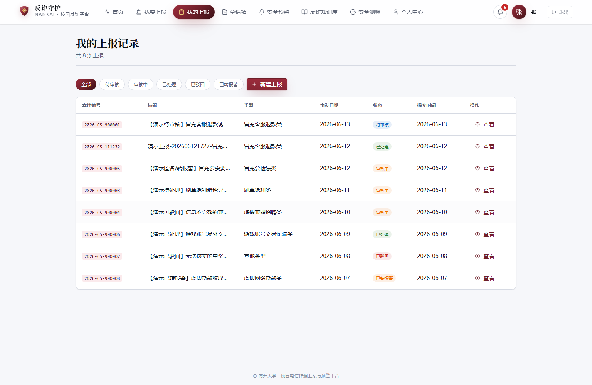

院系审核队列：

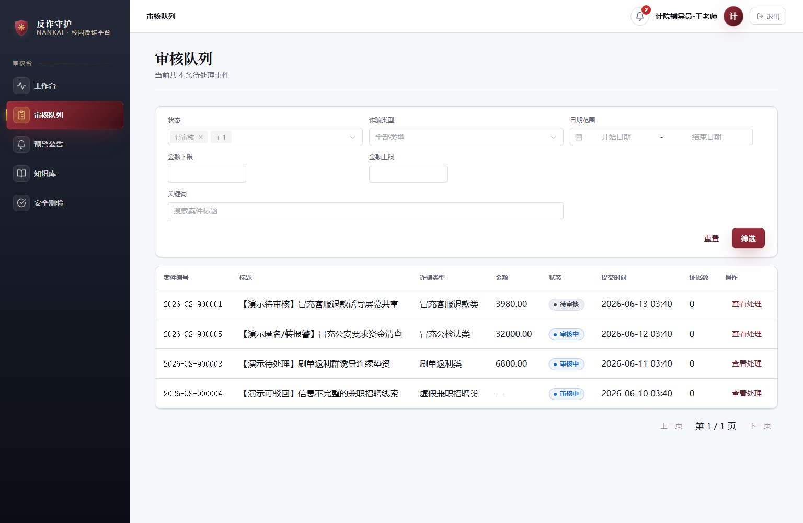

注意：

- seed 可重复执行，不会重复插入同名演示数据。
- seed 不会把已经被你处理过的演示案件自动改回初始状态。
- 如需完全恢复初始状态，使用 `make reset`；该命令会清空当前数据库，执行前务必确认不需要保留现场数据。

## 1. 演示前准备

操作：

1. 在项目根目录执行 `docker compose up -d --remove-orphans`。
2. 执行 `docker compose exec -T backend alembic upgrade head`。
3. 执行 `docker compose exec -T backend python -m app.infra.db.seed`。
4. 如需展示统一入口，执行 `docker compose --profile edge up -d edge`，访问 `https://localhost:8443/healthz`。
5. 如需展示监控面板，执行 `docker compose --profile observability up -d prometheus grafana`。
6. 打开前端 `http://localhost:5173`。

现场策略：

- 主线只新建 1 条学生上报，用于展示“学生低门槛提交”和生成案件编号。
- 案件审核、匿名司法协助、测验统计优先使用 seed 预置数据，减少现场临时造数据的风险。
- 四个角色尽量分开浏览器或浏览器配置文件登录，避免同一个 Cookie 被不同角色覆盖。

讲解：

“这个项目是前后端分离的校园反诈平台。演示环境使用 Mock CAS，不需要接真实统一身份认证。后端、前端、MySQL、Redis 和 MinIO 基础服务都通过 Docker Compose 一键拉起。当前 Docker 演示环境中，证据文件会先加密，再写入 MinIO/S3 对象存储；测试环境也可以切换为本地加密目录。”

验收点：

- 前端地址可打开。
- 后端 `http://localhost:8000/healthz` 返回 `{"status":"ok"}`。
- 快捷登录页能看到学生、院系审核员、校级审核员、系统管理员四类账号。

### 1.1 架构图讲解的准确话术

建议按图从上到下这样介绍：

> 学生和管理人员通过浏览器访问 Vue 3 前端，前端负责交互、表单校验和状态
> 展示。普通演示可以通过 HTTP 直接访问 Vite 和 FastAPI；如需展示统一入口，
> 可启用 `edge` profile，由 Nginx 接收 HTTPS 请求，完成 TLS 终止和反向代理，
> 避免应用服务直接暴露。
>
> 请求随后进入 FastAPI 应用层。登录会话保存在共享 Redis 中，不依赖某一台
> 应用服务器，因此具备横向扩展的基础。生产环境配置多个应用实例、健康检查
> 和负载均衡后，单个应用实例异常时可由其他实例继续处理请求。当前 Docker
> Compose 演示实际运行的是单个 FastAPI 容器。
>
> 数据层当前使用单实例 MySQL 处理读写，Redis 负责在线会话、权限缓存和部分
> 异步审计。生产目标可以扩展为 MySQL 主库和只读副本，但本项目目前没有实现
> 主从复制与读写分离。
>
> 证据文件在写入存储前会进行 AES-256-GCM 加密。Docker 演示环境默认写入
> MinIO/S3，测试环境可切换到本地加密目录；这样既避免把大文件放进关系数据库，
> 也便于在没有对象存储的测试环境中快速验证功能。
>
> 密钥管理采用可切换的 KMS 抽象。演示环境使用 LocalKMS，从环境变量主密钥
> 派生数据密钥；Vault 和 AWS KMS Provider 当前是占位实现，正式部署必须接入
> 独立 KMS，使密钥与密文分离。系统已经实现 Real CAS 3.0 Provider，但本地
> 演示默认使用 Mock CAS，不能表述为已经接通学校真实 CAS。
>
> 可观测性方面，后端已提供 Prometheus `/metrics` 指标端点，并输出结构化
> 日志；Prometheus 和 Grafana 可通过 `observability` profile 启动，集中日志
> 平台仍属于生产部署接入项。
> 指标和应用日志采集可以旁路进行，但高敏审计会与业务事务同步写入，失败时
> 会阻止操作完成，因此不能把所有审计都描述成完全不阻塞主链路。

逐句核验：

| 原表述 | 结论 | 演示时如何修正 |
| --- | --- | --- |
| 浏览器访问 Vue 3，前端负责交互、校验和展示 | 准确 | 可原样保留 |
| HTTPS 进入 Nginx，完成 TLS 终止和反向代理 | 可选演示 / 生产目标 | 普通演示不启用；需要展示时启动 `edge` profile |
| 请求进入 FastAPI 集群 | 仅生产目标 | 当前是单容器；生产镜像支持 Gunicorn 多 worker，但没有部署多节点负载均衡 |
| 会话不固定在某台服务器 | 基础能力已实现 | 会话在 Redis，可不使用粘性会话；高可用仍依赖负载均衡和 Redis HA |
| MySQL 主写从读 | 尚未实现 | 当前单 MySQL、单连接地址；不要声称已有读写分离 |
| Redis 负责会话和缓存 | 准确但不完整 | 还承担 RBAC 缓存、CAS ticket 去重和审计 Stream |
| MinIO/S3 保存证据 | 准确 | Docker 演示默认 `STORAGE_BACKEND=s3`，证据加密后写入 MinIO；测试可切本地 |
| KMS 统一管理密钥 | 仅抽象与本地实现完成 | 当前 LocalKMS；Vault/AWS KMS 仍是占位 |
| CAS 对接校园统一认证 | 接口实现、真实接入未完成 | Real CAS Provider 已实现，演示使用 Mock CAS |
| Prometheus、Grafana和日志系统已部署 | 部分实现 | `/metrics` 已实现；Prometheus/Grafana 可用 profile 启动；集中日志需生产接入 |
| 虚线组件不阻塞主链路 | 不能概括审计 | 指标采集可旁路；高敏同步审计属于主事务的一部分 |

如果答辩老师追问“如何把生产架构真正落地”，按以下顺序回答：

1. 正式部署 Nginx 配置、域名和可信 TLS 证书，只对外暴露 443。
2. 部署至少两个 FastAPI 实例并配置健康检查；把定时任务拆为独立 worker 或增加分布式锁。
3. 配置 MySQL 复制和只读连接池，在仓储层区分主库事务与可最终一致的查询。
4. 验证 MinIO/S3 桶权限、生命周期、备份策略和跨环境迁移。
5. 实现 Vault/AWS KMS Provider，启用密钥轮换并禁止生产使用 LocalKMS。
6. 部署 Redis Sentinel/Cluster 和集中日志平台，完善 Prometheus/Grafana 告警规则。

## 2. 登录与角色入口

### 2.1 打开快捷登录页

操作：

1. 打开 `http://localhost:5173/auth/mock-login`。
2. 先不要登录，指一下四个预设账号。

讲解：

“这里是开发演示用的 Mock CAS。四个账号分别代表系统管理员、校级审核员、院系审核员和学生。正式环境会替换成学校统一身份认证，平台本身不保存密码。”

截图：

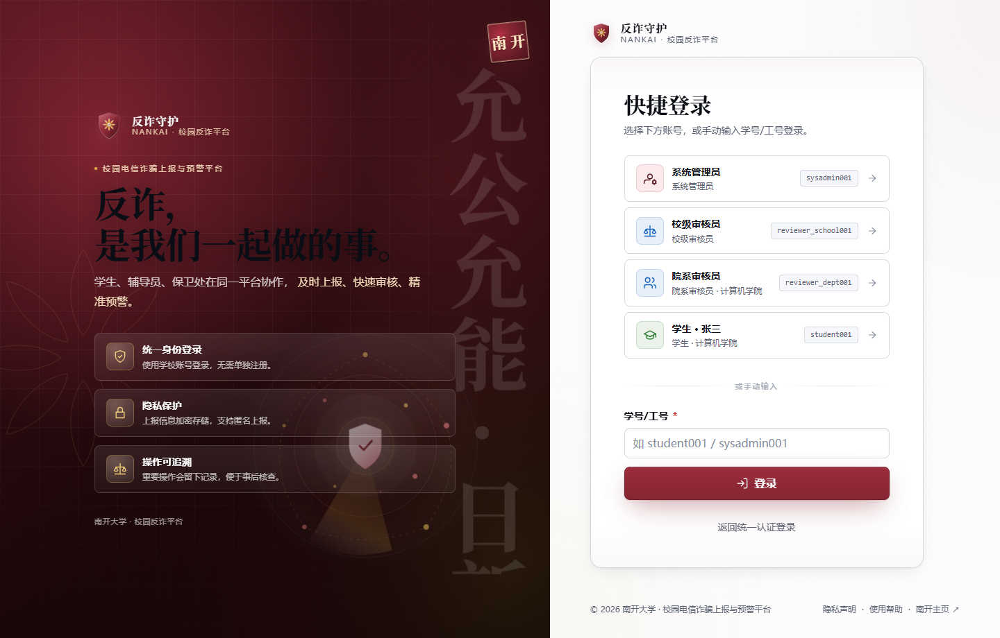

### 2.2 学生登录后首页

操作：

1. 点击“学生 · 张三”。
2. 进入学生首页。
3. 指出顶部导航：我要上报、我的上报、草稿箱、安全预警、反诈知识库、安全测验、个人中心。

讲解：

“学生端把上报入口放在最显眼的位置，同时首页会露出最高级别预警、知识库推荐和反诈热线。目标是让学生用最低成本上报，也能快速学习如何识别风险。”

截图：

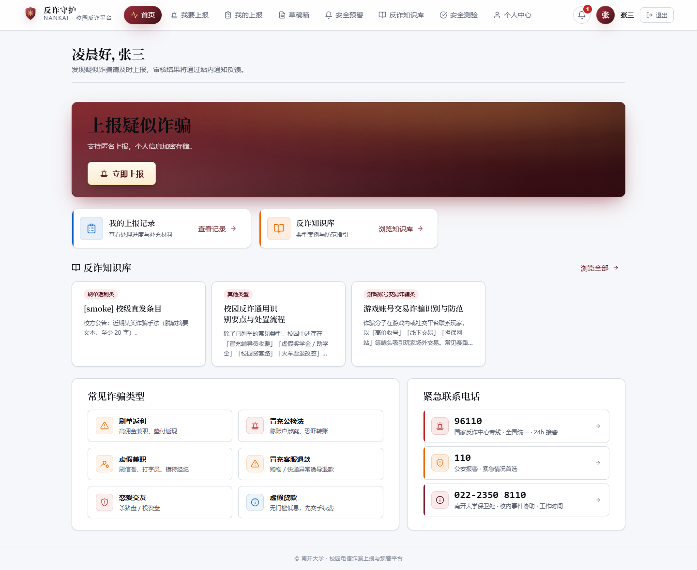

## 3. 学生端：疑似诈骗上报

### 3.1 填写上报表单

操作：

1. 点击顶部“我要上报”。
2. 在“标题”输入：`演示上报-202606121727-冒充客服退款`。
3. “诈骗类型”选择“冒充客服退款类”。
4. “事发日期”选择当天或最近日期。
5. “涉案金额”输入 `1299.00`。
6. “诈骗手法简述”输入：`冒充平台客服，要求屏幕共享并索要验证码`。
7. “经过描述”输入完整案情。
8. 点击“点击上传图片”，选择一张证据图片。
9. 勾选“匿名上报”。

建议现场输入的经过描述：

“今天下午收到自称电商平台客服的电话，对方声称我的订单存在质量问题，可以办理三倍退款。随后对方要求添加聊天账号、打开屏幕共享，并让我输入银行卡号和短信验证码。我没有继续操作，保留了聊天截图和通话记录，怀疑这是冒充客服退款类诈骗。希望平台尽快核实并提醒同学不要开启屏幕共享。”

讲解：

“表单只要求标题、类型、日期和经过描述，金额、手法、联系方式和证据都可以补充。这里勾选匿名上报后，审核员不能直接看到学生身份，身份映射会被加密隔离。”

提交前务必确认：

- 标题至少填写 1 个字符，最多 200 字。
- 经过描述至少填写 1 个字符，最多 5000 字。
- 诈骗类型和事发日期必须选择。
- 涉案金额可以不填；填写时必须大于等于 0，最多保留两位小数。
- 证据不是必填项，不上传证据也可以提交。

截图：

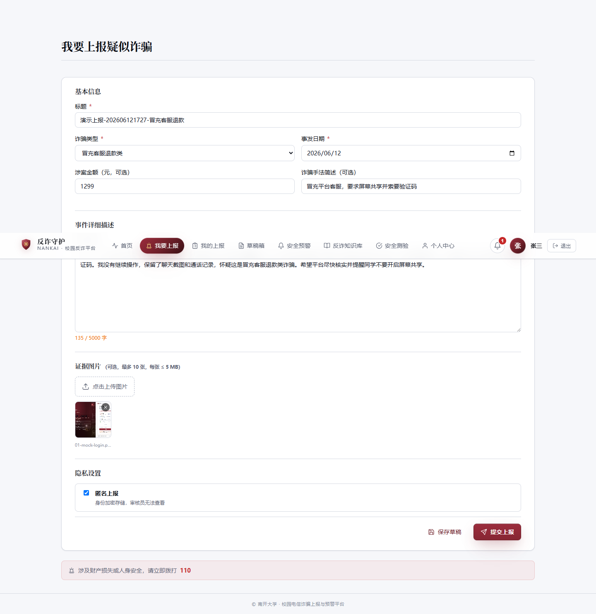

### 3.2 保存草稿

操作：

1. 点击页面底部“保存草稿”。
2. 弹出“草稿已保存”后确认。
3. 点击顶部“草稿箱”。

讲解：

“学生可能一时凑不齐证据，所以平台支持草稿。草稿会保存文字和已上传证据，并显示过期时间。后台有定时任务清理过期草稿和证据文件。”

截图：

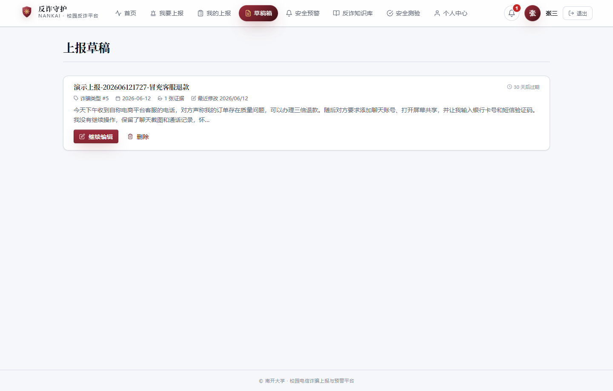

### 3.3 从草稿继续编辑并提交

操作：

1. 在草稿列表点击“继续编辑”。
2. 回到上报表单后，确认内容和证据仍在。
3. 点击“提交上报”。

讲解：

“从草稿提交时，系统会把草稿证据迁移为案件证据。提交成功后会生成一个可追踪的案件编号。”

截图：

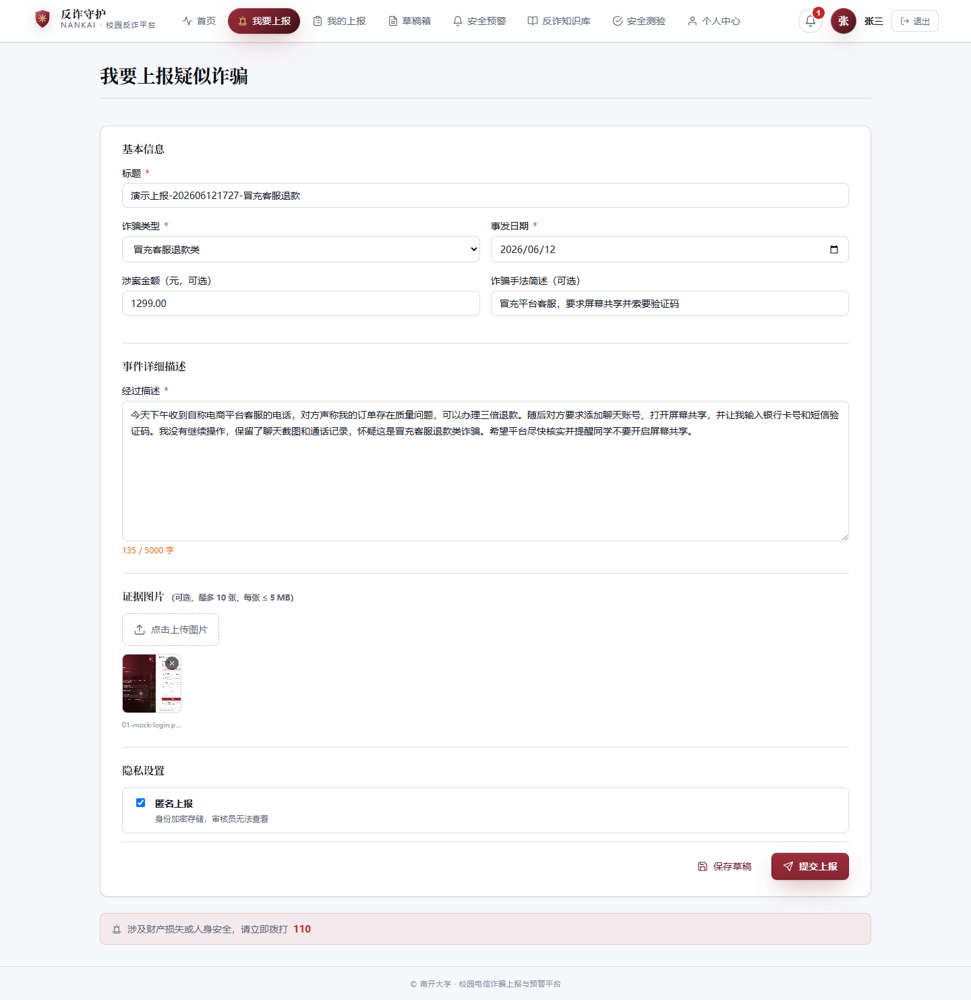

### 3.4 展示上报成功页

操作：

1. 指出“上报成功”。
2. 读出案件编号 `2026-CS-111232`。
3. 点击“查看我的上报”或“查看案件详情”说明后续可追踪。

讲解：

“案件编号采用年份、院系和流水号组合，便于学生查询和管理员追踪。状态变更会通过站内通知反馈。”

截图：

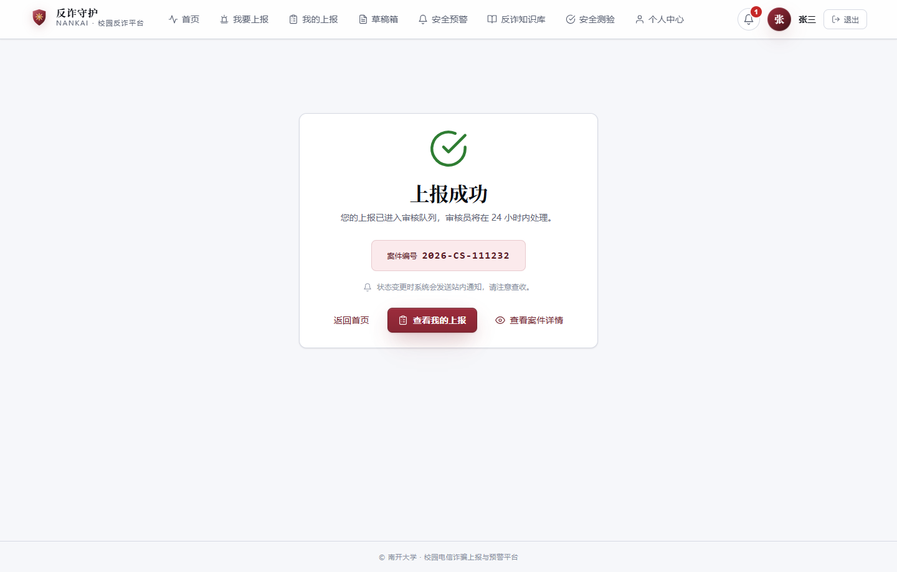

## 4. 审核管理员端：案件审核

### 4.1 进入审核工作台

操作：

1. 退出学生账号。
2. 使用 `reviewer_dept001` 登录。
3. 进入“工作台”。

讲解：

“院系审核员进入的是审核工作台。这里展示待审核、审核中、今日处理结果和近 7 天趋势，帮助老师先看整体负载，再进入队列处理。”

截图：

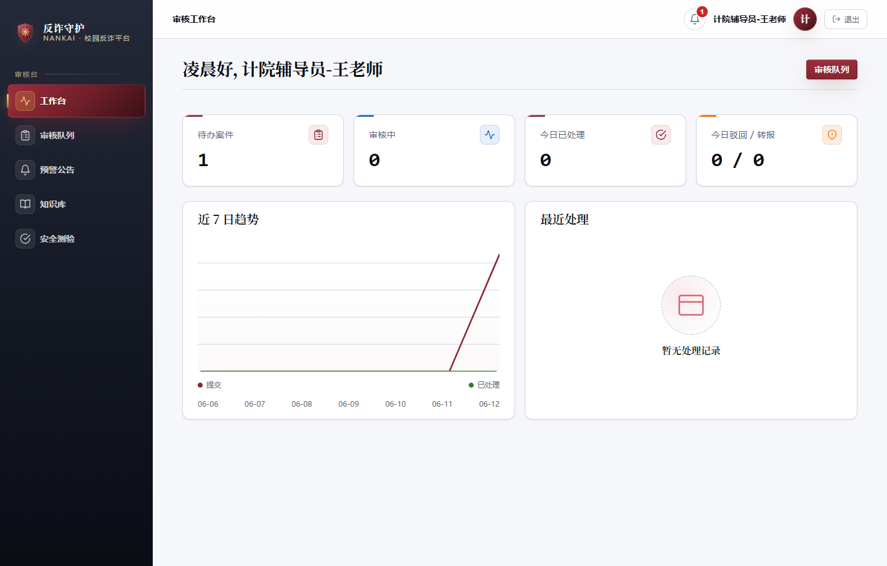

### 4.2 在审核队列中定位案件

操作：

1. 点击左侧“审核队列”。
2. 在关键词中搜索刚才的标题，或按默认待审核/审核中列表查找。
3. 找到 `演示上报-202606121727-冒充客服退款`。
4. 点击“查看处理”。

讲解：

“审核队列支持状态、诈骗类型、时间、金额和关键词筛选。院系级审核员只看到自己权限范围内的案件。”

截图：

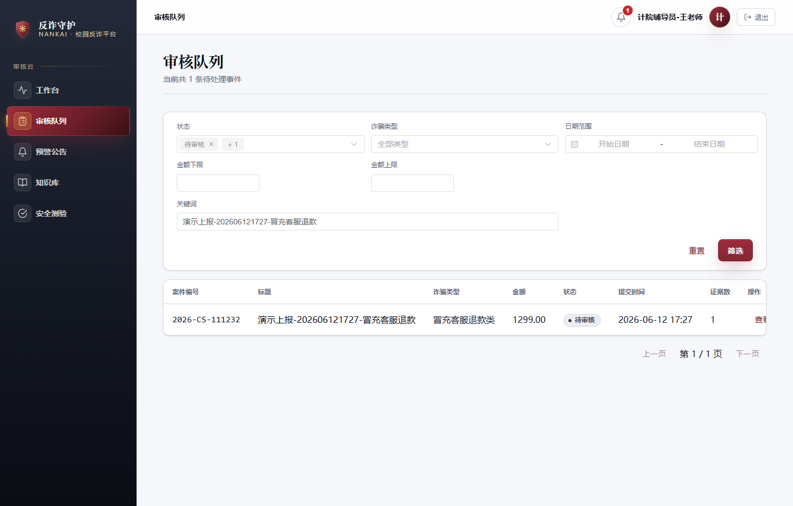

### 4.3 查看案件详情

操作：

1. 进入案件详情页。
2. 指出状态已经从“待审核”进入“审核中”。
3. 指出基本信息、事件经过、证据材料、上报者信息和处理时间线。
4. 如需展示证据，点击证据材料并确认敏感操作提示。

讲解：

“打开详情本身就是一个状态动作：待审核会变成审核中，并绑定当前审核员。查看证据、联系方式等敏感动作都要二次确认并写入审计日志。因为这条是匿名上报，普通审核员看不到真实身份。”

截图：

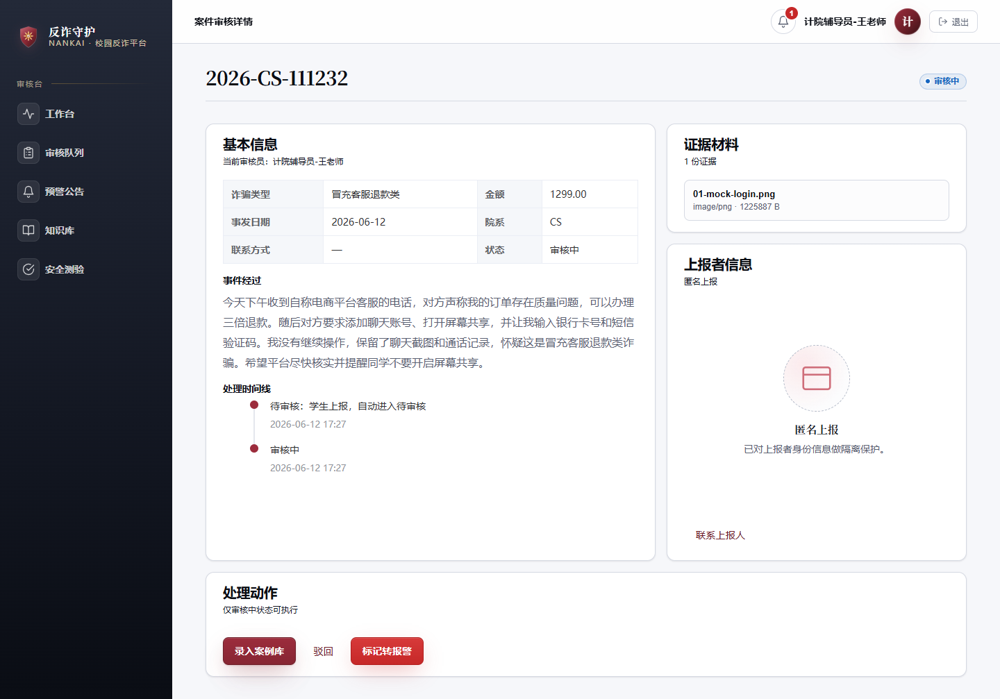

### 4.4 录入案例库并办结

操作：

1. 点击“录入案例库”。
2. 在弹窗填写：
   - 脱敏案例摘要：`学生收到冒充电商平台客服的退款电话，对方以订单质量问题为由诱导其开启屏幕共享并提供验证码，案件信息已完成脱敏处理。`
   - 识别要点：`主动退款、要求屏幕共享、索要银行卡号和短信验证码，是典型冒充客服退款诈骗信号。`
   - 防范建议：`退款理赔必须回到官方 App 内处理，不点击陌生链接，不开启屏幕共享，不向任何人提供验证码。`
3. 点击“确认提交”。

讲解：

“处理动作有三类：录入案例库并办结、驳回、转报警。这里选择办结，系统会更新案件状态、写状态历史、写审计，并把可沉淀的内容转成知识库草稿素材。”

截图：

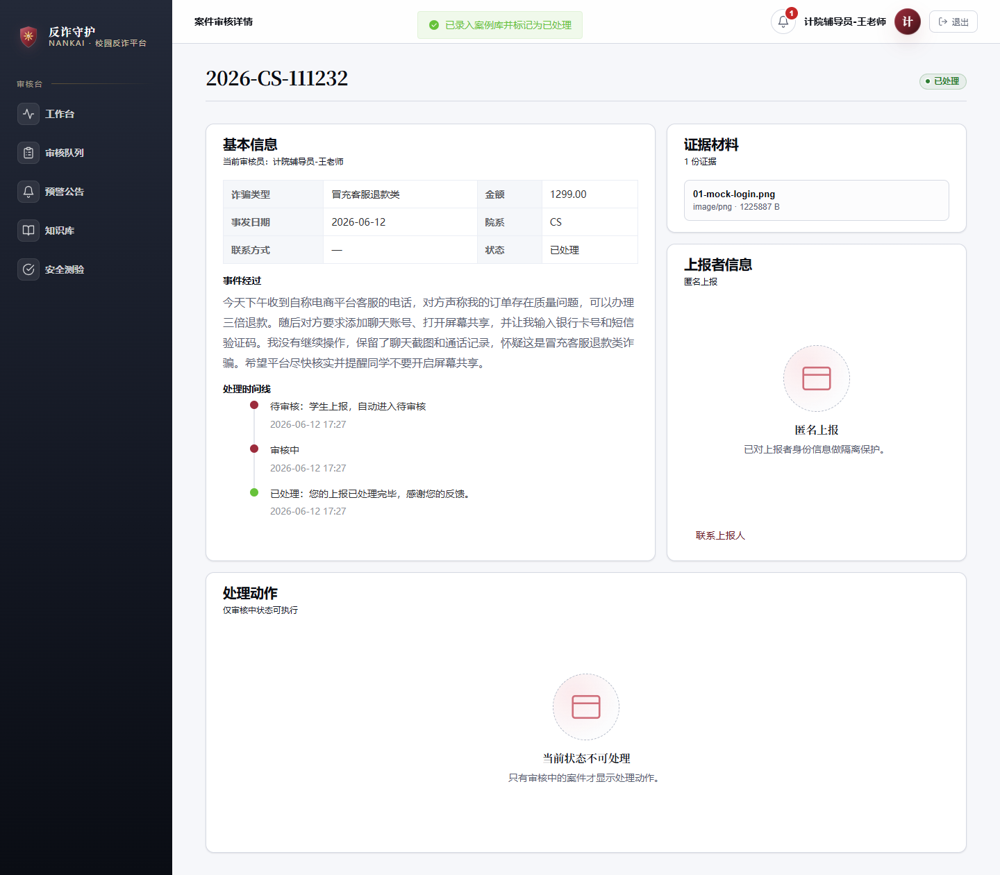

## 5. 校级审核员端：发布紧急预警

### 5.1 发布预警

操作：

1. 切换 `reviewer_school001`。
2. 进入“预警公告”。
3. 点击“发布预警”。
4. 标题输入：`演示预警-202606121727-冒充客服退款电话激增`。
5. 正文输入风险说明。
6. 预警等级选择“紧急级”。
7. 推送范围保持“全校”。
8. 关联案件编号填 `2026-CS-111232`。
9. 点击“发布预警”。

建议现场正文：

“近期出现多起冒充电商客服办理退款的电话。对方通常要求同学添加聊天账号、开启屏幕共享并输入短信验证码。请务必回到官方 App 核实，不点击陌生链接，不泄露验证码。”

讲解：

“预警支持提示、警告、紧急三级。紧急级只有校级审核员可以发，这是 RBAC 和业务规则双重控制。发布后会按全校或指定院系生成站内通知。”

截图：

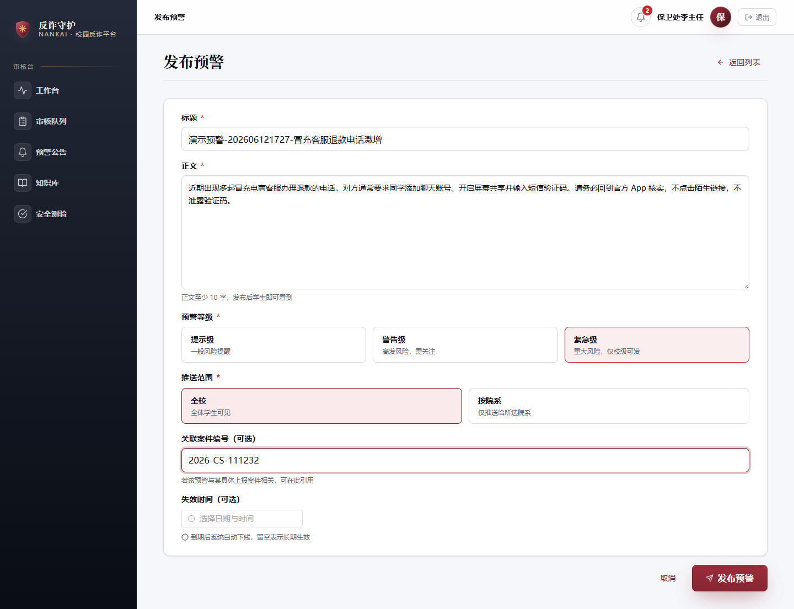

### 5.2 预警发布成功

操作：

1. 发布后进入预警详情页。
2. 指出标题、等级、范围、发布人、关联案件编号。
3. 可演示“追加说明”和“下线”按钮。

讲解：

“预警上线后学生端立即可见。如果后续有新情况，可以追加说明；风险解除后可以手动下线。下线原因同样会进入审计。”

截图：

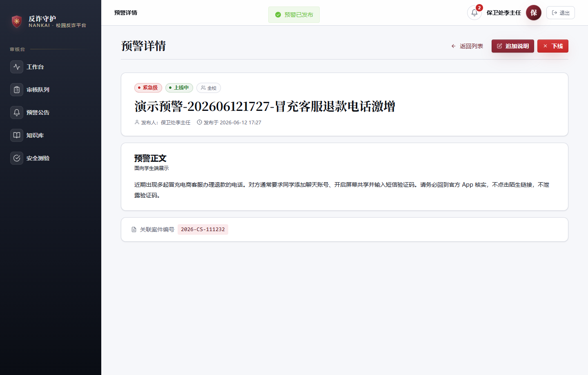

### 5.3 学生收到通知

操作：

1. 切回 `student001`。
2. 回到学生首页。
3. 点击右上角铃铛。
4. 指出刚发布的预警通知。

讲解：

“通知中心是全平台公共能力。案件处理、预警发布、知识审核、测验分配和截止提醒都可以走这个通道。点击通知能跳转关联对象。”

截图：

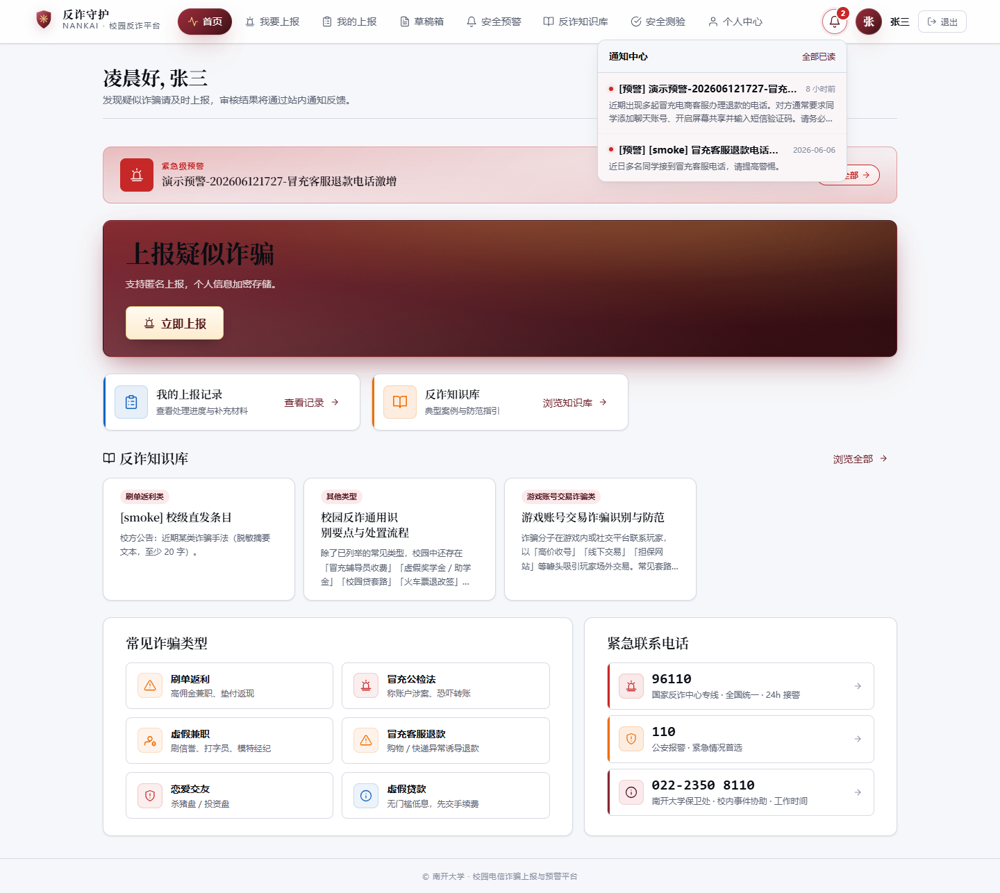

## 6. 知识库闭环：草稿、审核、发布、学生查看

### 6.1 院系审核员创建知识条目

操作：

1. 使用 `reviewer_dept001`。
2. 进入“知识库”。
3. 点击“新建知识条目”。
4. 标题输入：`演示知识-202606121727-冒充客服退款识别`。
5. 诈骗类型选择“冒充客服退款类”。
6. 填写脱敏摘要、识别要点、防范建议、高发时间段和来源引用。
7. 点击“保存并提交审核”。
8. 在确认框点击“提交”。

讲解：

“院系审核员可以创建知识草稿，但不能直接发布。知识条目要求脱敏摘要、识别要点和防范建议，确保对学生有可读性和可操作性。”

截图：

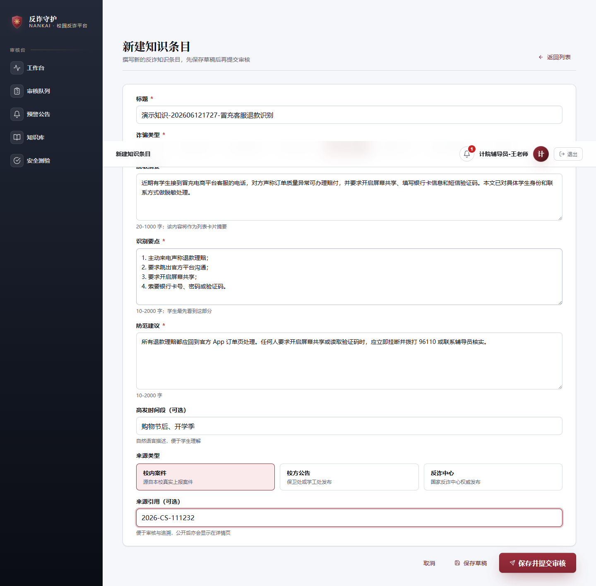

### 6.2 条目进入待审核

操作：

1. 提交后进入详情页。
2. 指出状态为“待审核”。
3. 指出版本号、作者、来源和历史记录。

讲解：

“知识库使用 DRAFT、PENDING、PUBLISHED、OFFLINE 状态流转。每次创建、提交、审核都会留下历史版本，便于追溯。”

截图：

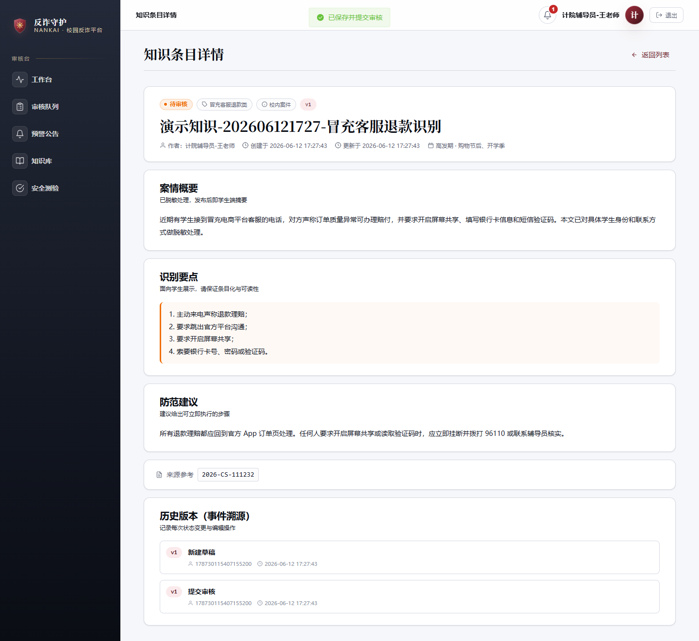

### 6.3 校级审核员通过发布

操作：

1. 切换 `reviewer_school001`。
2. 打开该知识条目详情。
3. 点击“通过发布”。
4. 审核备注输入：`内容已脱敏，识别要点完整，同意发布。`
5. 再点击弹窗里的“通过发布”。

讲解：

“校级审核员拥有知识审核权限。通过后条目状态变成已发布，学生端才能搜索和阅读；如果内容不合格，也可以驳回回草稿。”

截图：

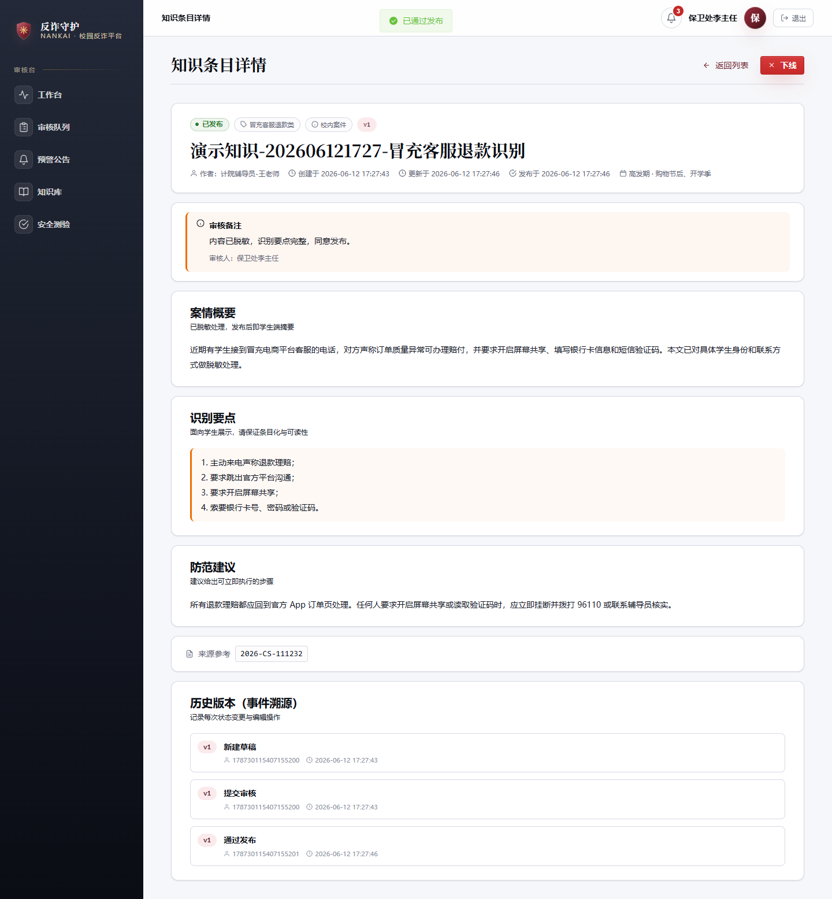

### 6.4 学生端查看知识详情

操作：

1. 切回 `student001`。
2. 进入“反诈知识库”。
3. 搜索或打开刚发布的条目。
4. 指出脱敏摘要、识别要点、防范建议和来源信息。

讲解：

“审核通过的案件经验会沉淀成可检索知识。学生看到的是脱敏后的教育内容，不会暴露具体上报人信息。”

截图：

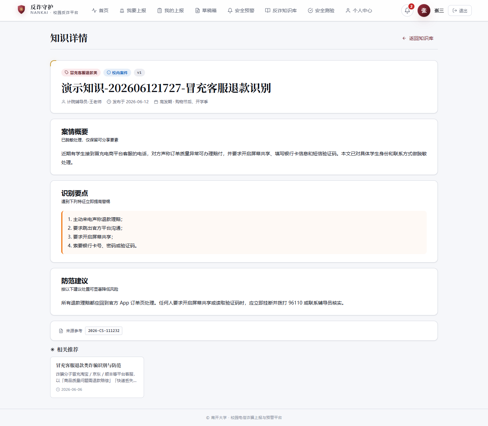

## 7. 学生端：安全测验与错题学习

### 7.1 打开安全测验

操作：

1. 使用 `student001`。
2. 点击顶部“安全测验”。
3. 指出随机练习、错题本和指定测验。

讲解：

“测验模块有两种模式：学生自主随机练习，以及管理员发起的指定测验。随机练习从启用题库中抽 10 题，指定测验可以按全校、院系或学生定向发布。”

截图：

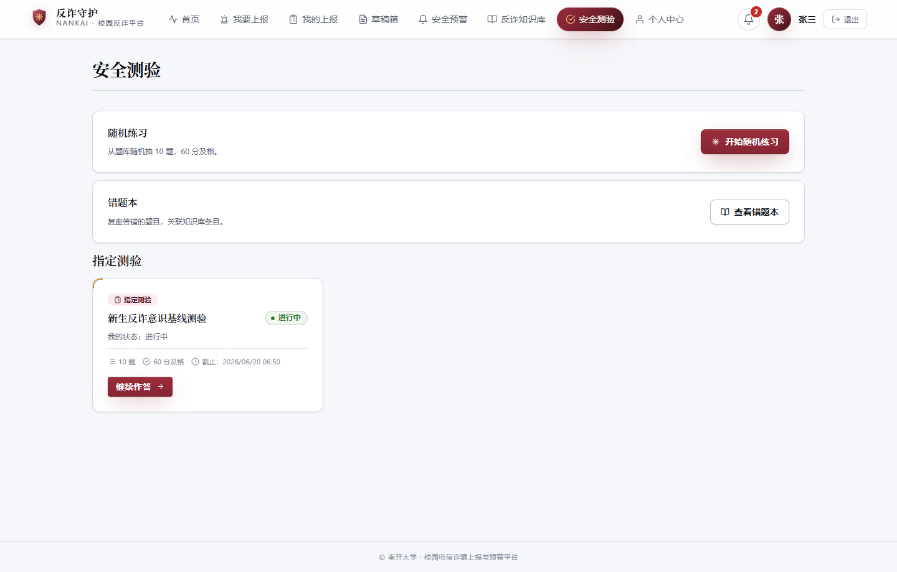

### 7.2 开始随机练习

操作：

1. 点击“开始随机练习”。
2. 进入答题页后，指出票面信息：题目数、已作答数量、及格分、题目导航。
3. 现场可以故意选 A 选项，让后面有错题展示。
4. 点击“下一题”直到最后提交。

讲解：

“答题时学生看不到正确答案和解析，只有提交后才会展示。这样既能完成测评，也能把错题引导回知识库学习。”

截图：

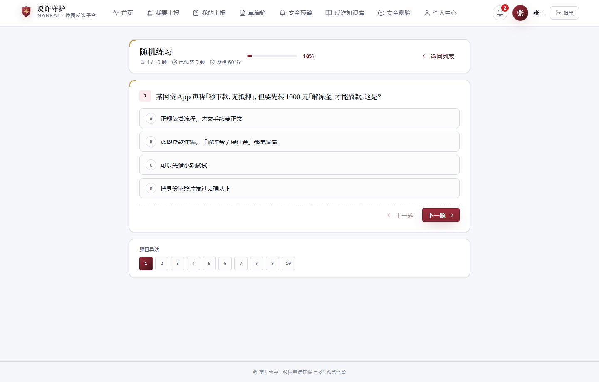

### 7.3 查看提交结果

操作：

1. 提交答卷。
2. 指出得分、是否通过、答对数和答错数。
3. 展示每题正确答案、本人答案和解析。
4. 点击“前往知识库学习”说明错题关联知识条目。

讲解：

“这里我故意选择了错误答案，所以能看到错题解析。题库可以关联知识库条目，学生答错后不是只看到分数，而是能马上跳转学习。”

截图：

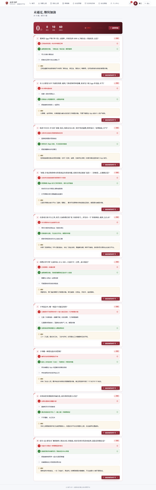

### 7.4 错题本

操作：

1. 进入“我的错题本”。
2. 展开任意错题。
3. 指出本人答案、正确答案、解析和知识库跳转。

讲解：

“错题本保留学生历史答错的题目，适合课后复盘。这个功能把测验和知识库串起来，形成学习闭环。”

截图：

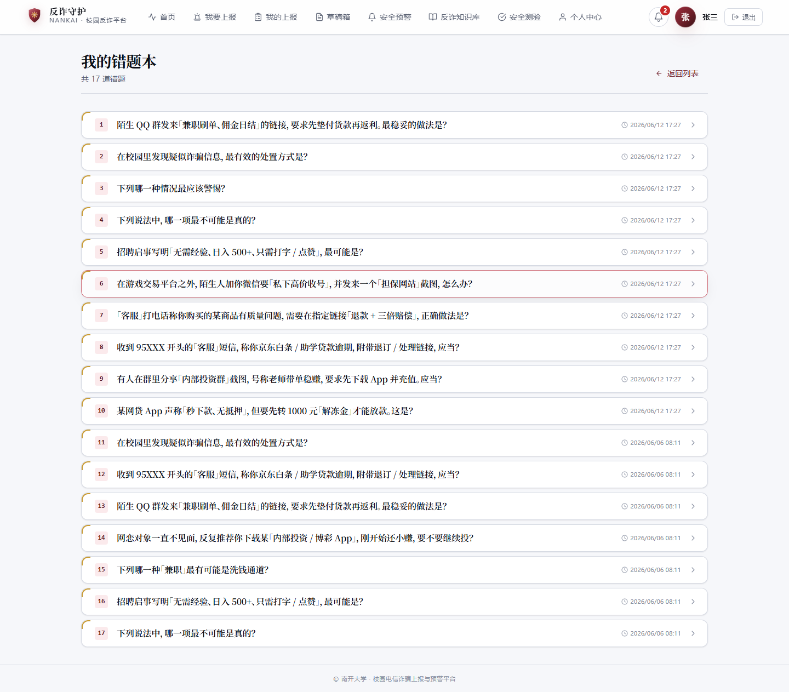

## 8. 审核管理员端：测验管理与统计

### 8.1 测验列表

操作：

1. 使用 `reviewer_school001`。
2. 点击“安全测验”。
3. 指出题库管理、发起测验、状态筛选和完成率报告入口。
4. 发起指定测验时至少选择 3 道题；随机练习仍固定抽取 10 道题。

讲解：

“管理员可以维护题库，也可以发起指定测验。测验有进行中、已结束、已撤回三种主要状态。”

截图：

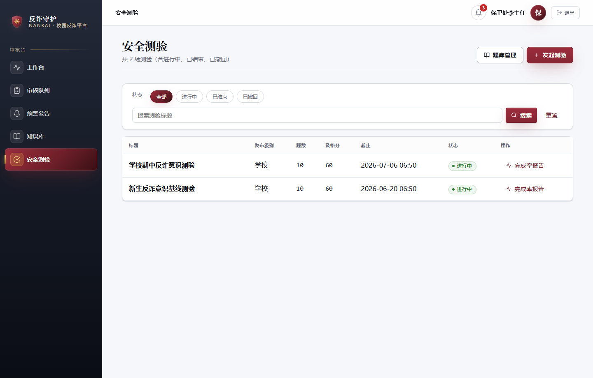

### 8.2 完成率报告

操作：

1. 点击任意测验的“完成率报告”。
2. 指出完成人数、目标人数、完成率、及格率、平均分。
3. 指出各院系完成情况。
4. 点击“导出 Excel”说明可下载报表。

讲解：

“校级审核员可以看全校分院系统计，院系审核员只能看本学院。报表可导出 Excel，方便交给辅导员或学院汇总。”

截图：

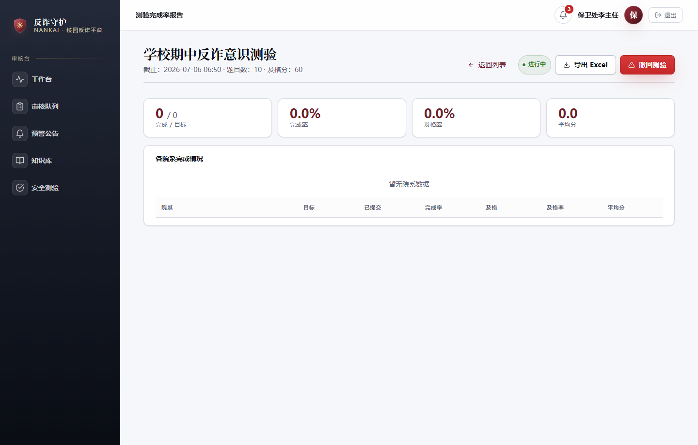

## 9. 系统管理员端：治理、审计与司法协助

### 9.1 系统概览

操作：

1. 使用 `sysadmin001` 登录。
2. 进入“概览”。
3. 指出账号总数、审计日志总数、司法协助申请、近期审计动态。

讲解：

“系统管理员不直接处理学生案件，重点是平台治理：账号、权限、审计和高敏司法协助。”

截图：

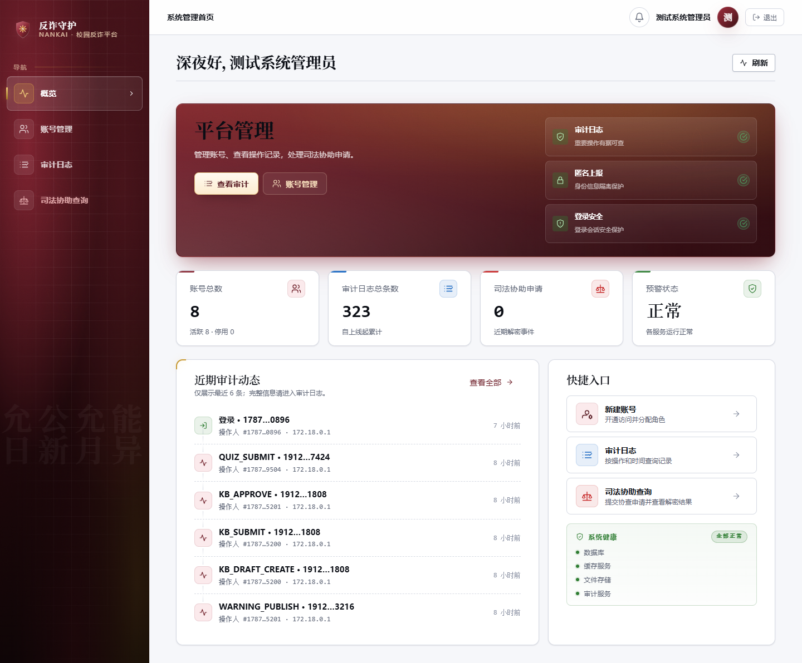

### 9.2 账号管理

操作：

1. 点击“账号管理”。
2. 使用搜索框按姓名或学号工号搜索。
3. 点击状态筛选“全部、正常、已停用”。
4. 点击“新建账号”，展示字段但不一定现场提交。

讲解：

“账号管理支持新增账号、按状态筛选和搜索。后端还提供角色变更、启停账号和 CSV 批量导入能力，可以通过 OpenAPI 演示。”

截图：

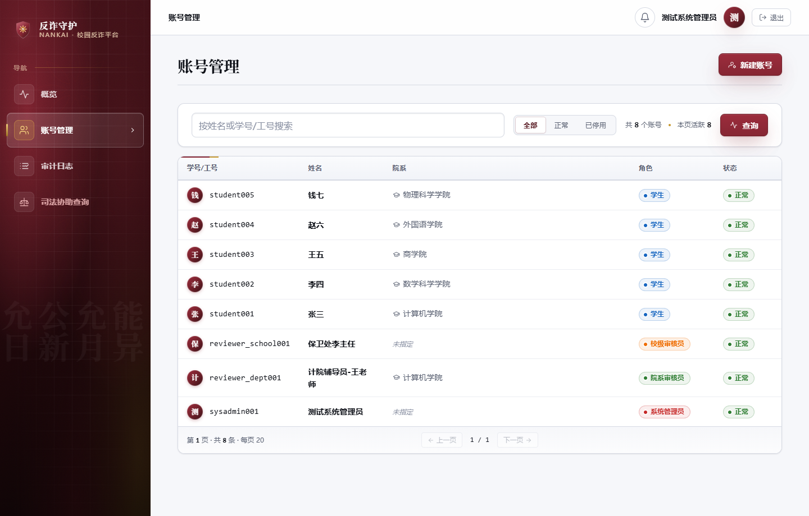

### 9.3 审计日志

操作：

1. 点击“审计日志”。
2. 按操作类型选择登录、创建账号、司法解密等。
3. 按对象类型和对象编号筛选。
4. 点击“导出 CSV”。
5. 确认浏览器下载 `audit_logs.csv`，页面保持在审计日志列表。

讲解：

“高敏操作都会写审计，包括登录、账号变更、状态流转、查看证据、发布预警、导出审计本身。审计日志还带 trace id，便于排查一次请求的全链路。”

导出故障排查：

- 正常结果是浏览器下载 CSV，页面不会跳走。
- 如果页面跳到 `localhost` 的 HTTP 500，检查前端容器日志是否包含 `http proxy error` 和 `ECONNREFUSED`。
- Docker 环境的 Vite 代理目标必须是 `http://backend:8000`，不能写容器内的 `http://localhost:8000`。
- CSV 使用 UTF-8 BOM，Excel 可直接识别中文；导出会沿用当前操作类型、对象类型、对象编号和操作人筛选条件。

其他导出与文件查看检查：

| 功能 | 正常结果 | 常见异常与处理 |
| --- | --- | --- |
| 测验完成率报告 XLSX | 下载 `.xlsx`，可打开“完成率报告”工作表 | 后端日志出现 `No module named openpyxl` 时，重新构建后端镜像；Dockerfile 已固定安装 `openpyxl` |
| 草稿证据查看 | 当前学生可打开本人草稿证据 | 404 通常表示草稿或文件编号不匹配；403 表示不是草稿所有者 |
| 审核证据查看 | 有证据查看权限的审核员确认敏感访问后打开文件 | 未带敏感访问确认头会被拒绝，这是权限保护，不是下载故障 |
| 中文下载文件名 | 浏览器使用响应中的中文或业务文件名 | 跨域环境需暴露 `Content-Disposition`；当前后端已配置 |

快速检查命令：

```powershell
docker compose exec -T backend python -c "import openpyxl; print(openpyxl.__version__)"
docker compose logs --tail=100 backend frontend
```

若 `docker compose up -d --build backend` 因 Docker Hub DNS 或临时网络问题无法重建，但后端容器仍在运行，可先执行下面的临时兜底命令保证现场导出功能可用；答辩后再在网络正常时重新构建镜像：

```powershell
docker compose exec -T backend uv pip install --python /opt/venv/bin/python "openpyxl>=3.1,<4.0"
```

截图：

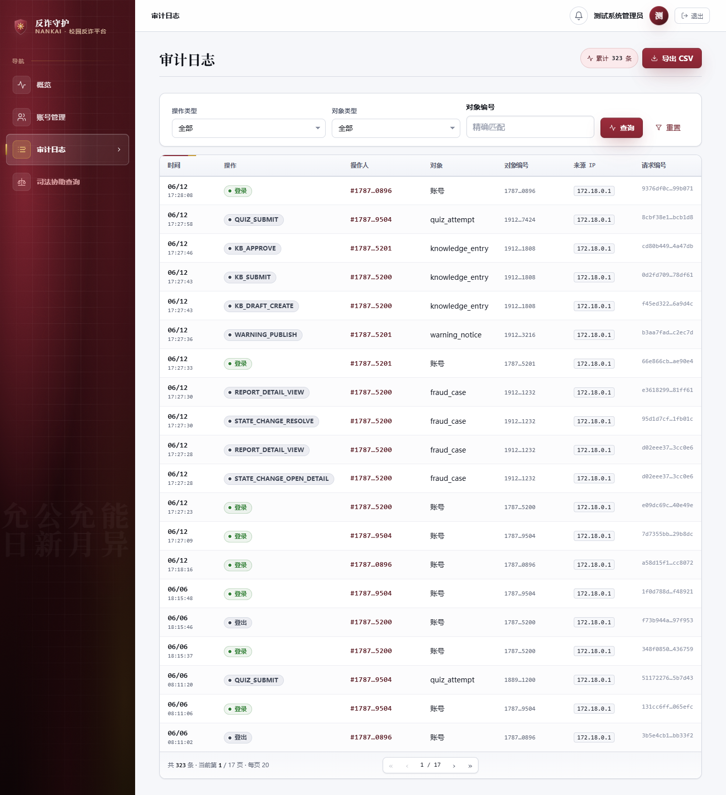

### 9.4 司法协助查询

操作：

1. 点击“司法协助查询”。
2. 开发演示环境直接点击右上角“填入演示数据”，页面会自动填入：
   - 事件编号 `990000000000000005`
   - 协查文书编号 `演示协查字〔2026〕第001号`
   - 关联案件编号 `2026-CS-900005`
   - 一段完整申请理由
3. 点击“提交申请”，在弹窗中说明本次申请会写入高敏审计日志，然后点击“确认提交”。
4. 页面会自动滚动到倒计时区域。指出倒计时从约 `05:00` 开始，并强调：
   - 不是等待 5 分钟后才能查看。
   - 是从现在开始拥有 5 分钟临时查看权限。
   - 仅当前申请账号可以使用这个窗口。
5. 点击“查看匿名上报人身份”。
6. 页面自动滚动到结果区，展示预置学生张三及账号 `student001`，背景水印包含申请人、时间和协查文书编号。
7. 最后进入“审计日志”，筛选司法协助相关操作，展示申请和实际查看分别留痕。

讲解：

“学生匿名上报后，普通审核员始终看不到真实姓名。只有系统管理员取得协查依据后，才能申请一个仅本人可用、有效期五分钟的临时查看窗口。五分钟不是等待时间，而是权限自动失效时间；申请和实际查看会分别写入审计，结果页面也带有水印。”

截图：

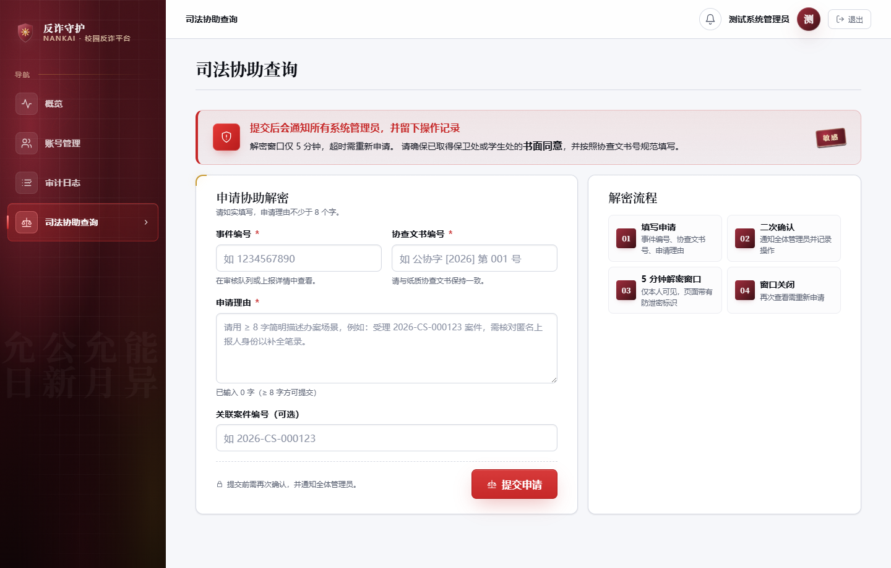

注意：

- 只能查询真正的匿名案件。非匿名事件或错误事件编号会提示没有匿名映射。
- 开发环境提供“填入演示数据”按钮；生产构建不会显示该按钮。
- 独立司法协助服务当前会记录高敏审计和管理员告警日志；不要讲成已经向所有管理员发送了站内通知。
- 若仍出现“申请理由必填，≥ 8 字”，当前后端是旧镜像。执行
  `docker compose up -d --build backend`，等待健康检查通过后刷新页面。

## 10. 现场讲解顺序建议

按这个顺序演示最顺：

1. “先看学生如何最低成本上报风险。”
2. “再看院系审核员如何处理案件。”
3. “然后看校级审核员如何把个案扩散成全校预警。”
4. “接着看案件经验如何沉淀为知识库。”
5. “再用测验证明学生端能学习、能复盘。”
6. “最后用系统管理员端证明高敏操作可追溯、权限可治理。”

开场白可以这样说：

“我们的平台解决的是校园诈骗事件从发现到处置再到教育沉淀的问题。学生端负责低门槛上报和学习，审核端负责案件流转、预警和知识维护，系统端负责账号权限、审计和司法协助。下面我按一个真实冒充客服退款案例走一遍完整闭环。”

收尾可以这样说：

“这条演示链路从学生匿名上报开始，经过审核处理、紧急预警、知识发布、测验复盘，最后在系统管理员端可以追溯审计记录。它不是一个孤立表单，而是一套完整的防诈处置闭环。”

### 10.1 稳妥演示数据分配

| 环节 | 推荐数据 | 原因 |
| --- | --- | --- |
| 学生现场上报 | 新建 1 条匿名上报 | 展示表单、证据上传和案件编号生成 |
| 案件审核办结 | `2026-CS-900003` | 初始为审核中，适合直接录入案例库并办结 |
| 案件驳回 | `2026-CS-900004` | 初始为审核中，适合演示驳回反馈 |
| 匿名保护和司法协助 | `2026-CS-900005` / 事件 `990000000000000005` | 已有匿名映射，能稳定解密 |
| 学生查看结果 | `2026-CS-900006`、`2026-CS-900007`、`2026-CS-900008` | 覆盖已处理、已驳回、已转报警 |
| 测验统计导出 | 预置已结束测验 | 已有目标人数和提交记录，导出更稳定 |

## 11. 演示时容易被问到的问题

问：匿名上报是否真的匿名？

答：“普通审核员看不到真实身份。身份映射单独加密保存，只有系统管理员在司法协助流程中填写文书编号和理由，并在 5 分钟窗口内才能查看，且全过程写入审计。”

问：为什么有院系审核员和校级审核员？

答：“院系审核员负责日常案件处理和普通风险预警；校级审核员拥有更高权限，例如紧急预警、知识条目审核和全校范围数据。”

问：预警到期后会自动下线吗？

答：“当前页面支持填写失效时间，数据字段也保存了失效时间；但代码中暂未发现自动下线调度任务。现场演示建议用手动下线，并把自动下线作为后续增强点说明。”

问：测验和知识库有什么关系？

答：“题库题目可以关联知识库条目。学生答错后可以直接跳到对应知识条目学习，从测评变成复盘。”

问：审计是否可篡改？

答：“审计日志采用追加写和链式哈希校验，平台还提供 `make verify-audit` 用来校验审计链完整性。导出审计日志本身也会被审计。”

## 12. 演示故障排查与防错清单

### 12.1 “提交上报”无法点击或点击后未提交

典型现象：

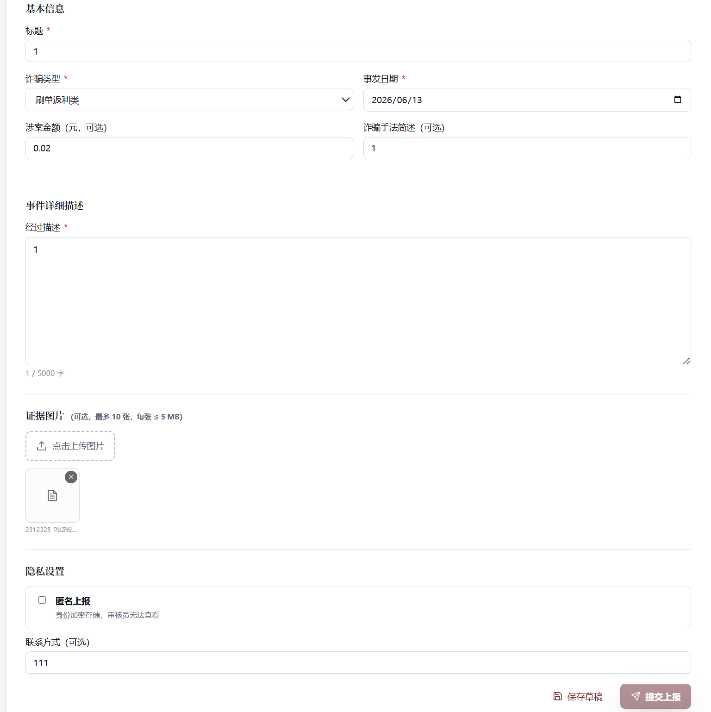

旧版页面里，这类问题通常不是服务器故障，而是表单校验没有通过：

- 旧版标题和经过描述有较长字数限制。
- 当前演示版已降低字数门槛，标题和经过描述填写 `1` 也可以通过字数校验。
- 诈骗类型、事发日期和金额 `0.02` 都是有效的。
- 诈骗手法和联系方式是可选项，填写 `1` 不会阻止提交。
- 证据图片是可选项，是否上传不会影响提交按钮。

修复方法：

1. 确认标题不是空白。
2. 确认经过描述不是空白。
3. 确认诈骗类型已选择。
4. 确认事发日期已选择。
5. 再点击“提交上报”。

当前页面会提示：

- 标题为空时显示“请输入标题”。
- 描述为空时显示“请输入事件经过”。
- 按钮上方汇总还未完成的字段。
- 点击提交时会把焦点移到第一个不合格字段，不再静默无响应。

修复后的页面效果：

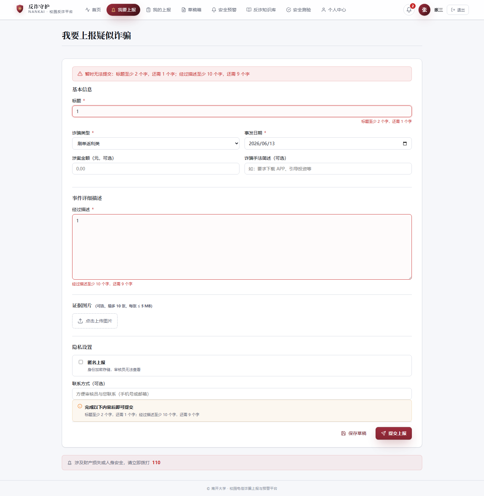

演示时可以这样说明：

“这里故意只输入一个字也能通过字数门槛。系统现在只拦截空白必填项、未选择类型或日期、金额格式错误等真正影响提交的数据；如果按钮有反应但没有产生案件，先看红色校验提示，不要重复点击。”

### 12.2 点击提交后提示 401 或跳回登录页

原因：

- 登录会话已过期。
- 在同一个浏览器配置文件中登录了另一个角色，原角色 Cookie 被覆盖。

处理：

1. 重新登录对应账号。
2. 多角色演示时使用不同浏览器、不同浏览器用户配置文件或独立无痕会话。
3. 不要在同一个 Chrome 普通窗口的不同标签页登录不同角色。

推荐窗口分配：

| 浏览器环境 | 账号 |
| --- | --- |
| Chrome 普通配置文件 | `student001` |
| Edge | `reviewer_dept001` |
| Chrome 无痕窗口 | `reviewer_school001` |
| Firefox 或第二个浏览器配置文件 | `sysadmin001` |

### 12.3 页面打开但数据一直加载失败

检查顺序：

1. 执行 `docker compose ps`。
2. 确认 backend、mysql、redis、minio 为 `healthy`。
3. 打开 `http://localhost:8000/healthz`，应返回 `{"status":"ok"}`。
4. 若容器未运行，执行 `docker compose up -d --remove-orphans`。
5. 若账号或字典数据缺失，执行：

```powershell
docker compose exec -T backend alembic upgrade head
docker compose exec -T backend python -m app.infra.db.seed
```

### 12.4 诈骗类型下拉框为空

可能原因：

- 后端没有运行。
- 数据库迁移或种子数据未执行。
- 当前登录会话失效。

处理：

1. 检查 `/healthz`。
2. 重新执行迁移和 seed。
3. 刷新页面并重新登录。

### 12.5 证据文件无法上传

规则：

- 单个案件最多 10 个证据文件。
- 单个文件不能超过 5 MB。
- 支持 JPEG、PNG、GIF、WebP、BMP、TIFF 和 PDF。

常见问题：

- 文件大于 5 MB。
- 浏览器或系统把文件识别成不支持的 MIME 类型。
- 已达到 10 个文件上限。
- 后端文件存储目录不可写。

演示建议：

- 提前准备一张 100 KB 至 1 MB 的 PNG 或 JPEG。
- 文件名使用简单中文或英文，不使用过长文件名。
- 正式答辩前先上传一次，确认预览和提交都正常。

#### 点击提交后出现 `Network Error`

如果证据已经上传，点击提交时却出现 `Network Error`，先不要连续重复点击。旧版后端在读取中文文件名的证据时，会把中文名称直接写入 HTTP 响应头，触发 Latin-1 编码异常并返回 500；浏览器有时只把它显示成笼统的 `Network Error`。当前版本已改为 RFC 5987 UTF-8 文件名编码，中文文件名可以正常预览和提交。

现场排查步骤：

1. 先打开“我的上报”，检查是否已经生成案件编号；提交请求可能已经成功，只是随后的证据预览请求失败。
2. 查看后端日志：

```powershell
docker compose logs backend --tail 100
```

3. 如果日志含有 `UnicodeEncodeError`、`latin-1` 和 `Content-Disposition`，说明运行的还是旧版代码。更新代码并重启后端：

```powershell
git pull
docker compose up -d --build backend
```

4. 来不及更新时，可临时把证据文件改成纯英文名，例如 `evidence-01.png`，删除旧证据后重新上传。
5. 如果“我的上报”里已经有案件编号，不要再次提交，避免产生重复案件。

本次故障的判断口诀可以这样介绍：

“看到 `Network Error` 不等于案件一定没提交。先查我的上报是否已有案件编号，再看后端日志；这样既能定位中文文件名兼容问题，也能避免重复上报。”

### 12.6 点击“保存草稿”后看不到草稿

处理：

1. 确认浏览器没有切换到其他学生账号。
2. 点击顶部“草稿箱”后手动刷新一次。
3. 检查是否弹出“草稿已保存”。
4. 检查后端是否正常。

说明：

“草稿属于当前学生，其他学生无法查看。草稿更新会刷新 30 天有效期。”

### 12.7 审核队列中找不到刚提交的案件

检查：

1. 确认学生提交成功页已经生成案件编号。
2. 审核队列状态筛选包含“待审核”和“审核中”。
3. 清空旧关键词，使用案件标题或案件编号搜索。
4. 确认当前院系审核员与学生属于同一院系。
5. 校级审核员可用于排除院系范围问题。

本演示中：

- `student001` 属于计算机学院。
- `reviewer_dept001` 也是计算机学院审核员。

### 12.8 案件进入详情后处理按钮不显示

处理动作只在 `REVIEWING` 状态显示。

可能原因：

- 案件已被其他审核员办结、驳回或转报警。
- 页面数据仍是旧状态。
- 当前账号没有 `report:review` 权限。

处理：

1. 刷新详情页。
2. 返回审核队列检查当前状态。
3. 换一条待审核案件重新演示。

#### 录入案例库弹窗点击“确认提交”看似无反应

典型现象：在“录入知识库案例”弹窗中，三个必填项都填了 `1`，点击“确认提交”后没有办结成功。

旧版原因：请求已经发到后端，但后端会按较长字数校验，返回 422 参数校验失败；页面又没有把原因显示清楚，所以看起来像“没反应”。

当前演示版已放开字数下限：

- 脱敏案例摘要、识别要点、防范建议、驳回原因和转报说明，填 `1` 也可以提交。
- 内部备注仍然可选。
- 若仍然出现 422，说明后端还停留在旧版本，执行 `git pull` 后重新构建后端。

为了让答辩更自然，正式演示仍建议填稍完整的示例：

- 脱敏案例摘要：`学生收到冒充电商客服的退款电话，对方诱导其开启屏幕共享并索要验证码。`
- 识别要点：`核实来电身份；拒绝屏幕共享；验证码不得告知他人。`
- 防范建议：`遇到退款理赔先通过官方渠道核验，切勿转账或泄露验证码。`

### 12.9 院系审核员无法发布紧急预警

这是正常的权限规则：

- 院系审核员可以发布提示级和警告级预警。
- 紧急级预警只能由校级审核员发布。

处理：

1. 院系审核员演示普通预警。
2. 切换 `reviewer_school001` 演示紧急预警。

### 12.10 知识条目没有“通过发布”按钮

检查：

- 条目必须处于 `PENDING` 待审核状态。
- 当前账号必须是校级审核员并拥有 `kb:review` 权限。

正确顺序：

1. `reviewer_dept001` 创建草稿并提交审核。
2. `reviewer_school001` 打开同一条目。
3. 点击“通过发布”或“驳回”。

### 12.11 学生看不到刚发布的知识条目

检查：

1. 管理端状态是否已经是“已发布”。
2. 学生端是否仍停留在旧列表缓存。
3. 清空搜索和诈骗类型筛选。
4. 刷新知识库列表。
5. 确认条目没有被下线。

### 12.12 随机测验无法开始

可能原因：

- 题库中启用题目不足 10 道。
- 当前账号不是学生。
- 登录会话过期。

处理：

1. 执行 seed，恢复示例题库。
2. 使用 `student001` 登录。
3. 确认管理员题库中至少有 10 道启用题。

### 12.13 指定测验无法作答

检查：

- 测验状态必须为 `ACTIVE`。
- 截止时间不能已经过去。
- 学生必须在全校、目标院系或指定学生范围内。
- 已提交的指定测验不能重复提交。

### 12.14 司法协助页面解密失败

可能原因：

- 输入的事件不是匿名上报。
- 事件没有对应匿名映射数据。
- 5 分钟窗口已经过期。
- 当前操作人不是原申请人。
- 当前账号不是系统管理员。

演示建议：

- 直接使用 seed 预置匿名事件 ID `990000000000000005`，关联案件编号为 `2026-CS-900005`。
- 先讲清申请理由和文书编号，再提交。
- 提交后立即执行窗口内解密，不要中途切换账号。

### 12.15 截图或页面样式没有更新

处理：

1. 浏览器执行强制刷新：`Ctrl + F5`。
2. 确认打开的是 `http://localhost:5173`。
3. 查看 `docker compose logs --tail=100 frontend`。
4. 必要时执行：

```powershell
docker compose restart frontend
```

### 12.16 答辩前 5 分钟最终检查

- [ ] 四个角色分别保持独立登录态。
- [ ] 学生窗口能打开上报页并看到诈骗类型。
- [ ] 准备好的证据图片小于 5 MB。
- [ ] 审核队列默认包含待审核和审核中。
- [ ] 校级审核员能进入预警和知识审核页面。
- [ ] 题库至少有 10 道启用题。
- [ ] 系统管理员能打开审计日志。
- [ ] 所有容器处于运行状态。
- [ ] 记录本次现场生成的案件编号，后续搜索统一使用该编号。
